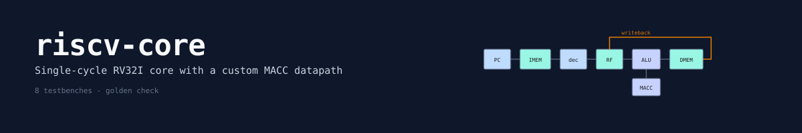
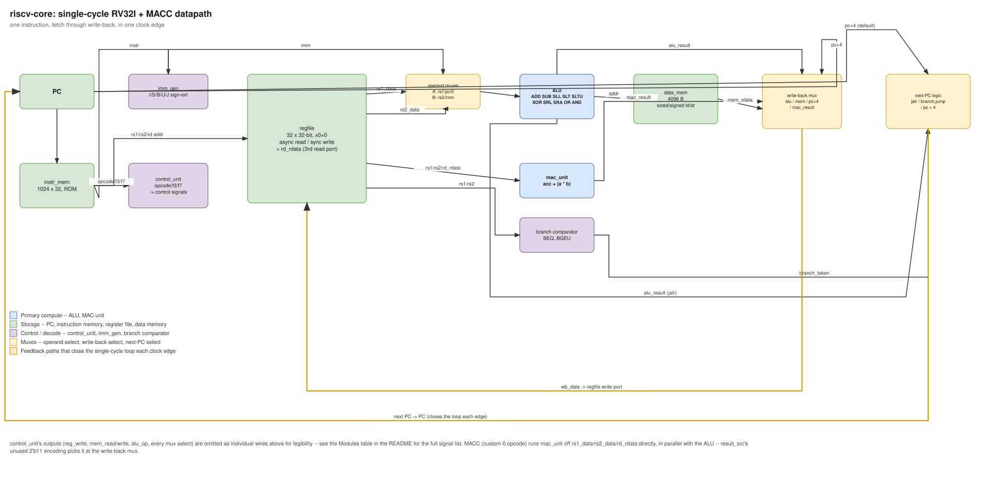
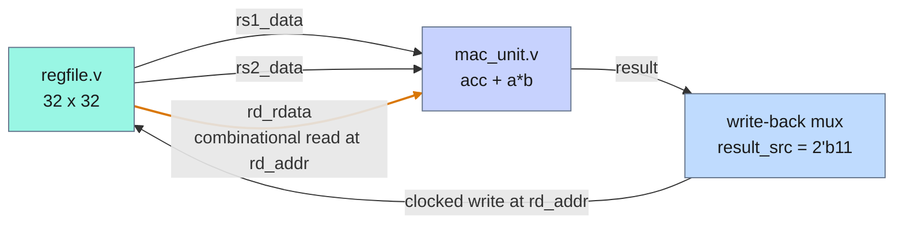
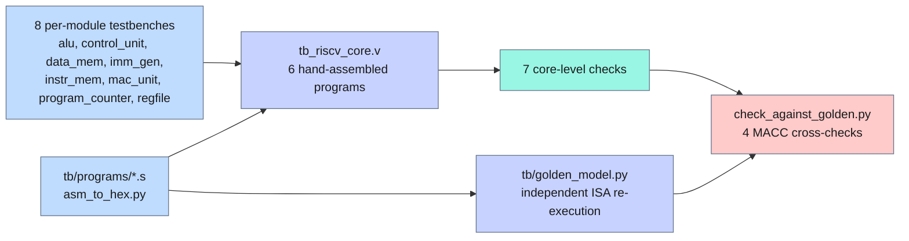

# riscv-core

A single-cycle RV32I core in Verilog, plus a custom multiply-accumulate instruction
on top of it. Built to understand the RISC-V ISA end to end at the RTL level rather
than to read the spec. Every module has its own self-checking testbench, the full
core runs six hand-assembled programs, and the MACC results are cross-checked
against an independent Python re-implementation of the ISA.

## At a glance

| | |
|---|---|
| ISA | RV32I without FENCE, ECALL or CSRs, plus a custom-0 MACC |
| Tests | 8 directed testbenches plus 1 golden cross-check, all passing |
| Integration | 6 hand-assembled programs, 7 core-level checks |
| Checking | expected values per testbench, plus `tb/golden_model.py` re-executing the same instruction words |
| Reference model | `tb/golden_model.py`, written from the ISA, not from the RTL |
| Bugs found | 1, in the assembler rather than the RTL. See below |
| Coverage | none collected; no assertions, no covergroups |
| Toolchain | Icarus Verilog 13.0, Python 3.14.5 |

```
$ make -C sim sim
...
PASS [arithmetic_mem0] = 35
PASS [sum_loop_mem4] = 55
PASS [loadstore_pass_flag] = 1
PASS [macc_single_mem0] = 142
PASS [macc_single_aliasing_mem4] = 9
PASS [macc_dot_product_mem0] = 300
PASS [macc_overflow_mem0] = 1
RISCV_CORE TB: PASS (7 checks)
...
GOLDEN [macc_single_mem0] = 142 (matches sim)
GOLDEN [macc_single_aliasing_mem4] = 9 (matches sim)
GOLDEN [macc_dot_product_mem0] = 300 (matches sim)
GOLDEN [macc_overflow_mem0] = 1 (matches sim)
GOLDEN_CHECK: PASS (4 checks)
```

## Why this is hard

A processor is one of the few designs where being nearly right is indistinguishable
from being right, for a while. A core with a broken sign-extension path still runs
most programs. One that mis-decodes a rarely used immediate format passes every
test that does not use it. The bugs hide in the instructions you did not think to
write a program for.

That makes the verification problem the interesting one. Checking a core against
hand-written expected values only proves the core agrees with whatever you believed
when you wrote the test. If the same misunderstanding went into both the RTL and
the test, they agree and both are wrong. The only way out is a second
implementation, derived from the specification rather than from the design, and
that is what `tb/golden_model.py` is for.

## How it works

Single-cycle, not pipelined: fetch, decode, execute, memory access and write-back
all happen for one instruction between two clock edges, then the next instruction
starts fresh.

That was a deliberate starting point. A five-stage pipeline overlaps instructions
for throughput, but it also brings hazard detection, forwarding and
branch-misprediction handling -- a large surface area for subtle bugs that has
nothing to do with understanding the ISA. Single-cycle keeps the whole datapath
reasonable to hold in your head and verifiable against hand-written programs.



Two decisions in that datapath are worth pointing at.

**The branch comparator does not touch the ALU.** Reusing the ALU's SUB output and
a zero flag for BEQ and BNE is the textbook approach, and it works, but it occupies
the ALU with the branch comparison in the same cycle JALR needs it free for a
target-address add. A small standalone combinational block off `rs1_data` and
`rs2_data` sidesteps that, and it was easier to get right in isolation:
`tb_riscv_core.v` never exercises the ALU for branches at all.

**ALU source A is a 3-way mux -- `rs1`, `pc`, zero -- not 2-way.** That lets LUI and
AUIPC reuse the adder instead of needing their own hardware. AUIPC becomes `pc +
imm` with `alu_op=ADD`, LUI becomes `0 + imm`. Two fewer special cases in the
write-back path.

## MACC

`MACC rd, rs1, rs2` computes `rd = rd + (rs1 * rs2)` in one cycle. It is not part
of RV32I. It sits in the custom-0 opcode space RISC-V reserves for exactly this, and
it exists because dot-product workloads -- the core of most inference math -- are
otherwise a MUL and ADD pair per element, doubling both instruction count and
register-file traffic.

```text
 31        25 24     20 19     15 14  12 11      7 6            0
+------------+---------+---------+------+---------+--------------+
|  0000001   |   rs2   |   rs1   | 000  |   rd    |   0001011    |
|   funct7   |  source |  source |funct3| acc/dst |   custom-0   |
+------------+---------+---------+------+---------+--------------+
```

### The third read port

`rd` is both a source, the accumulator, and the destination. That needs three
register reads in one instruction, and the register file has two read ports.



The orange edge is the third port. `regfile.v` exposes `rd_rdata`, a combinational
read at `rd_addr` -- the same address the write port already uses.

Nothing sequences those two accesses against each other, and nothing needs to.
Because the read is combinational and the write is a clocked nonblocking
assignment, `rd_rdata` holds the old value for the entire cycle no matter what MACC
is about to write. The new value is not visible until the next posedge. This is not
a special case added for MACC; it is how the register file already behaved for
every other instruction. `tb_regfile.v` checks that exact property, as
`rd_rdata_sees_old_value_mid_write`.

`mac_unit.v` reads `rs1_data`, `rs2_data` and `rd_rdata` directly rather than
through the ALU's source muxes, and always computes. The previously unused
`result_src` encoding `2'b11` only decides whether anyone uses its output this
cycle.

### Two encoding details worth stating

**Overflow is silent 32-bit wraparound**, the same as the ALU's ADD everywhere else.
No trap, no saturation. The low 32 bits of a 32x32 product are bit-identical whether
the operands are read as signed or unsigned, so no separate signed multiply path is
needed. `tb_mac_unit.v` checks this directly with `-1 * -1 = 1` and
`-1 * 5 = 0xFFFFFFFB`, and there is no `$signed()` cast anywhere in `mac_unit.v`.

**`funct7` is not gated.** The decoder checks `opcode` and `funct3` for MACC, not
the documented `funct7 = 0000001`. This core does not trap on any malformed
instruction anywhere -- an unrecognised opcode is a silent no-op rather than an
illegal-instruction exception -- so enforcing `funct7` strictly for this one
instruction would be inconsistent with the rest. `tb_control_unit.v` confirms the
choice is deliberate, as `MACC_funct7_not_gated`.

## Verification



Red is where an independent implementation gets a vote.

**Stimulus** is directed. Every module gets a self-checking testbench before it goes
near the top-level core. `tb_riscv_core.v` then runs six hand-assembled programs
through the whole thing: general ALU work, a branch-driven loop, load and store
round trips exercising sign and zero extension, and three MACC programs covering a
single MACC with register aliasing, a four-element dot product, and 32-bit
wraparound.

**Checking** happens twice, and the second time is the one that matters.
`tb_riscv_core.v` compares results against constants written into the testbench.
`tb/check_against_golden.py` then decodes and executes the same raw instruction
words in Python, using `tb/golden_model.py`, and re-derives the expected values
from scratch. An arithmetic mistake on my part would otherwise show up as a passing
test checking the wrong number.

### A bug this caught, in the assembler rather than the RTL

`tb/programs/asm_to_hex.py`'s `halt` pseudo-op is `jal x0, 0`, meant as an infinite
self-loop. It encoded a bare numeric jump target as an *absolute* address rather
than a *relative* offset, so `halt` actually jumped back to address 0 and restarted
the program.

It passed every existing test purely by luck. Restarting a deterministic program
recomputes the same values, and 300 simulated cycles was always enough for one full
pass before the check fired. Nothing in the RTL was wrong and nothing in the
hand-written expectations disagreed.

What surfaced it was the golden model expecting a true self-loop and never seeing
one. That is the entire argument for a second implementation: the failure was in
the tooling that built the stimulus, which is precisely the layer a self-consistent
testbench cannot check. Fixed by treating a bare numeric `jal` or branch target as
a relative offset.

### What is not verified

No assertions and no functional coverage, so there is no measure of which
instruction encodings the six programs actually reach. No randomized instruction
streams and no comparison against a reference implementation such as Spike across
a broad program corpus, which is what would give real confidence in RV32I
conformance rather than in the paths these programs happen to walk. The golden
model covers MACC only.

`instr_mem.v` also emits six `$readmemh` warnings during the run, one per program,
because each image is shorter than the configured 1024-word range. Harmless, and
noise that should be silenced rather than lived with.

## Design decisions

**Single-cycle over pipelined.** Covered in [How it works](#how-it-works). The cost
is throughput and a long critical path; what it buys is a design whose correctness
can be reasoned about directly. Rejected alternative: a five-stage pipeline, which
is the right answer for a core meant to be fast and the wrong one for a core meant
to be understood first.

**A standalone branch comparator.** Rejected alternative: reusing the ALU's SUB and
zero flag, which is smaller but contends with JALR for the adder in the same cycle.

**A 3-way ALU source A mux.** Rejected alternative: a 2-way mux plus dedicated LUI
and AUIPC paths in write-back, which moves the cost rather than removing it and adds
two special cases.

**A combinational third read port rather than sequencing logic.** Rejected
alternative: a two-cycle MACC that reads the accumulator in one cycle and writes in
the next, which would have made MACC the only multi-cycle instruction in a
single-cycle core and complicated the PC logic for no gain.

**A golden model written from the ISA, not from the RTL.** Rejected alternative:
deriving expected values from the design, which produces a check that agrees with
the design by construction and proves nothing.

## Instruction support

R-type: ADD, SUB, SLL, SLT, SLTU, XOR, SRL, SRA, OR, AND.
I-type: ADDI, SLTI, SLTIU, XORI, ORI, ANDI, SLLI, SRLI, SRAI, JALR.
Loads and stores: LB, LH, LW, LBU, LHU, SB, SH, SW.
Branches: BEQ, BNE, BLT, BGE, BLTU, BGEU.
Jumps: JAL, JALR. Upper immediate: LUI, AUIPC. Custom: MACC.

Not implemented: FENCE, ECALL, EBREAK, CSRs. No exceptions and no interrupts. This
was never meant to run an operating system, only to be a correct integer core.

## Interface reference

| Module | Interface | What it does |
|---|---|---|
| `program_counter.v` | `pc_next -> pc`, sync | Holds the PC, updates every cycle |
| `instr_mem.v` | `addr -> instr`, comb, `$readmemh` loaded | Word-addressed ROM, 1024 x 32 |
| `imm_gen.v` | `instr -> imm`, comb | Sign-extends I, S, B, U and J immediates by opcode |
| `control_unit.v` | `opcode, funct3, funct7 -> control signals`, comb | Decodes every control signal in the datapath |
| `regfile.v` | `rs1_addr, rs2_addr -> rs1_data, rs2_data` async; `rd_addr, rd_data, we` sync; `rd_rdata` async | 32 x 32-bit, `x0` hardwired to zero |
| `alu.v` | `a, b, alu_op -> result, zero`, comb | ADD SUB SLL SLT SLTU XOR SRL SRA OR AND |
| `data_mem.v` | `addr, wdata, funct3, mem_read, mem_write -> rdata` | Byte-addressable, 4096 B, sized and signed loads and stores |
| `mac_unit.v` | `acc, a, b -> result`, comb | `acc + (a * b)` |
| `riscv_core.v` | `clk`, `rst`, parameter `HEXFILE` | Wires the above plus the operand, write-back and next-PC muxes and the branch comparator |

## Build and run

Needs [Icarus Verilog](https://steveicarus.github.io/iverilog/) 13.0 and Python 3.

```sh
make -C sim sim     # assembles the programs, runs every unit test, the full
                    # core, then cross-checks MACC against golden_model.py
make -C sim wave    # opens the last VCD in gtkwave
```

A single module, if you only want to poke at one:

```sh
iverilog -o /tmp/tb_alu.vvp rtl/alu.v tb/tb_alu.v && vvp /tmp/tb_alu.vvp
```

`make sim` writes `core.vcd` into the repository root. It is gitignored.

## Repository layout

```text
.
|-- rtl/          synthesizable Verilog sources
|-- tb/           testbenches, hand-assembled programs, the golden model
|-- sim/          Makefile for Icarus Verilog
|-- diagrams/     banner, datapath figure, and their generators
|-- LICENSE
'-- README.md
```

## Limitations and next steps

- No pipeline. See [How it works](#how-it-works) for why single-cycle was the
  deliberate starting point. Adding forwarding and hazard detection is the natural
  next step.
- No exceptions, interrupts or CSRs, so no FENCE, ECALL or EBREAK.
- MACC's `funct7` is not checked. Consistent with the core's no-trap behaviour
  everywhere else, but worth knowing if this ever has to interoperate with a
  toolchain that assumes strict encoding checks.
- No assertions and no functional coverage, so instruction-encoding coverage is
  unmeasured. Running against a reference implementation across a broad program
  corpus would say far more about RV32I conformance than six programs can.
- The golden model covers MACC only. Extending it to the whole ISA would make the
  independent-implementation argument apply to every instruction rather than one.
- Six `$readmemh` range warnings per run, from program images shorter than the
  1024-word instruction memory. Cosmetic, and worth silencing.

## References

- [The RISC-V Instruction Set Manual, Volume I: Unprivileged Architecture](https://riscv.github.io/riscv-isa-manual/snapshot/spec/)
- [IEEE 1364-2005, Verilog Hardware Description Language](https://standards.ieee.org/ieee/1364/3641/)
- [Icarus Verilog](https://steveicarus.github.io/iverilog/)

## License

MIT -- see [LICENSE](LICENSE).
