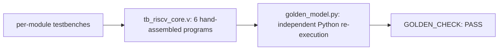

# riscv-core


A single-cycle RV32I core in Verilog, plus a custom multiply-accumulate
(MACC) instruction on top of it. Built to understand the RISC-V ISA end
to end at the RTL level, not just read the spec. Every module has its
own self-checking testbench, the full core runs six hand-assembled
programs, and MACC results are cross-checked against an independent
Python re-implementation of the ISA.

| | |
|---|---|
| ISA | RV32I (no FENCE/ECALL/CSRs) + custom-0 MACC |
| Tests | 7 core-level checks + 4 independent golden-model cross-checks, all passing |
| Verification | per-module testbenches, a 6-program integration test, and a from-scratch Python golden model |

```
$ cd sim && make sim
...
PASS [arithmetic_mem0] = 35
PASS [sum_loop_mem4] = 55
PASS [loadstore_pass_flag] = 1
PASS [macc_single_mem0] = 142
PASS [macc_single_aliasing_mem4] = 9
PASS [macc_dot_product_mem0] = 300
PASS [macc_overflow_mem0] = 1
RISCV_CORE TB: PASS (7 checks)
GOLDEN [macc_single_mem0] = 142 (matches sim)
GOLDEN [macc_single_aliasing_mem4] = 9 (matches sim)
GOLDEN [macc_dot_product_mem0] = 300 (matches sim)
GOLDEN [macc_overflow_mem0] = 1 (matches sim)
GOLDEN_CHECK: PASS (4 checks)
```

## Architecture

Single-cycle, not pipelined: fetch, decode, execute, memory access, and
write-back all happen for one instruction in a single clock edge, then
the next instruction starts fresh. A 5-stage pipeline would overlap
instructions for higher throughput, but it also means hazard
detection, forwarding, and branch-misprediction handling -- a lot of
surface area for subtle bugs that has nothing to do with actually
understanding the ISA. Single-cycle keeps the whole thing easy to
reason about and easy to verify against hand-written test programs.
Pipelining it is a natural next step (see [Limitations](#limitations--next-steps)).


Two decisions worth calling out:

- **The branch comparator doesn't touch the ALU.** Reusing the ALU's
  SUB output and a zero flag for BEQ/BNE (the textbook approach) works,
  but it means the ALU is busy with the branch comparison in the same
  cycle it also needs to be free for JALR's target-address add. A
  small standalone combinational block off `rs1_data`/`rs2_data`
  sidesteps that and was also easier to get right in isolation --
  `tb_riscv_core.v` doesn't exercise the ALU for branches at all, only
  the comparator logic does.
- **ALU source A is a 3-way mux (rs1 / pc / zero), not 2-way.** This
  lets LUI and AUIPC reuse the ALU's adder instead of needing their
  own hardware: AUIPC is `pc + imm` with `alu_op=ADD`, LUI is `0 +
  imm`. Two fewer special cases in the write-back path.

## MACC

`MACC rd, rs1, rs2` computes `rd = rd + (rs1 * rs2)` in one cycle. It's
not part of RV32I -- it's encoded in the custom-0 opcode space RISC-V
reserves for exactly this kind of extension. It exists because
dot-product-style workloads (the core of most ML inference math) are
otherwise a MUL + ADD pair per element, doubling both instruction
count and register-file traffic.

R-type field layout:

| Field | Bits | Value |
|---|---|---|
| funct7 | [31:25] | 0000001 |
| rs2 | [24:20] | source register 2 |
| rs1 | [19:15] | source register 1 |
| funct3 | [14:12] | 000 |
| rd | [11:7] | destination / accumulator |
| opcode | [6:0] | 0001011 (custom-0) |

`rd` is both a source (the accumulator) and the destination, which the
register file's existing two read ports can't cover -- reading three
different registers in one instruction needs a third read port.
`regfile.v` exposes `rd_rdata`: a combinational read at `rd_addr`, the
same address the write port already uses. Because that read is
combinational and the write is a clocked nonblocking assignment,
`rd_rdata` reflects the OLD value for the entire cycle regardless of
what MACC is about to write -- the new value isn't visible until the
next posedge. No extra sequencing logic needed; this is just how the
register file already worked for every other instruction. `tb_regfile.v`
checks this exact property (`rd_rdata_sees_old_value_mid_write`).

`mac_unit.v` runs off `rs1_data`/`rs2_data`/`rd_rdata` directly, not
through the ALU's source muxes, and always computes -- `result_src`'s
previously-unused `2'b11` encoding just decides whether anyone uses
the output this cycle.

Overflow is silent 32-bit wraparound, same as the ALU's ADD everywhere
else -- no trap, no saturation. The low 32 bits of a 32x32 product are
bit-identical whether the operands are read as signed or unsigned, so
no separate signed multiply path is needed; `tb_mac_unit.v` checks
this directly (`-1 * -1 = 1`, `-1 * 5 = 0xFFFFFFFB`, no `$signed()`
cast anywhere in `mac_unit.v`).

`funct7` isn't gated: the decoder checks `opcode` and `funct3` for
MACC, not the documented `funct7=0000001`. This core doesn't trap on
any malformed instruction anywhere -- an unrecognized opcode is a
silent no-op, not an illegal-instruction exception -- so checking
`funct7` strictly for just this one instruction would be inconsistent
with everything else. `tb_control_unit.v`'s `MACC_funct7_not_gated`
check confirms this is deliberate.

## Module interface

| Module | Interface | What it does |
|---|---|---|
| `program_counter.v` | `pc_next -> pc`, sync | Holds PC, updates every cycle |
| `instr_mem.v` | `addr -> instr`, comb, `$readmemh`-loaded | Word-addressed ROM, 1024 x 32 |
| `imm_gen.v` | `instr -> imm`, comb | Sign-extends I/S/B/U/J-type immediates by opcode |
| `control_unit.v` | `opcode,funct3,funct7 -> {reg_write, mem_read, mem_write, is_branch, jump, jalr, alu_src_a, alu_src_b, result_src, alu_op}`, comb | Decodes every control signal in the datapath |
| `regfile.v` | `rs1_addr,rs2_addr -> rs1_data,rs2_data` (async); `rd_addr,rd_data,we` (sync write); `rd_rdata` (async, 3rd read port) | 32 x 32-bit, x0 hardwired to zero |
| `alu.v` | `a,b,alu_op -> result,zero`, comb | ADD SUB SLL SLT SLTU XOR SRL SRA OR AND |
| `data_mem.v` | `addr,wdata,funct3,mem_read,mem_write -> rdata`, sync write / async read | Byte-addressable, 4096 B, sized/signed ld/st |
| `mac_unit.v` | `acc,a,b -> result`, comb | `acc + (a * b)`, used by MACC |
| `riscv_core.v` | `clk, rst`, parameter `HEXFILE` | Wires all of the above, plus the operand/write-back/next-PC muxes and the branch comparator |

## What's implemented

R-type: ADD, SUB, SLL, SLT, SLTU, XOR, SRL, SRA, OR, AND
I-type: ADDI, SLTI, SLTIU, XORI, ORI, ANDI, SLLI, SRLI, SRAI, JALR
Loads/stores: LB, LH, LW, LBU, LHU, SB, SH, SW
Branches: BEQ, BNE, BLT, BGE, BLTU, BGEU
Jumps: JAL, JALR
Upper immediate: LUI, AUIPC
Custom: MACC

Not implemented: FENCE, ECALL/EBREAK, CSRs -- no exceptions or
interrupts. This wasn't meant to run an OS, just to be a correct
integer core.

## Verification approach



Every module gets its own self-checking testbench under `tb/` before
it goes anywhere near the top-level core. `tb_riscv_core.v` then runs
six hand-assembled programs (general ALU ops, a branch-driven loop,
load/store round trips with sign/zero extension, and three MACC
programs -- a single MACC plus a register-aliasing case, a 4-element
dot product, and 32-bit wraparound) through the whole core and checks
the results land in the right memory addresses.

For MACC specifically, `tb/check_against_golden.py` adds a second,
independent layer: `tb/golden_model.py` decodes and executes the same
raw instruction words the Verilog core runs and re-derives expected
values from scratch, instead of trusting the hardcoded constants in
`tb_riscv_core.v` alone -- an arithmetic mistake on my part would
otherwise show up as a "passing" test checking the wrong number.

This caught a real bug once, not in the RTL: `tb/programs/asm_to_hex.py`'s
`halt` pseudo-op (`jal x0, 0`, meant as an infinite self-loop) encoded
a bare numeric jump target as an *absolute* address instead of a
*relative* offset, so `halt` actually jumped back to address 0 and
restarted the program. It "worked" for every existing test purely by
luck -- restarting a deterministic program recomputes the same values,
and 300 simulated cycles was always enough for one full pass before
the check fired. The golden model expects a true self-loop and never
saw one, which is what surfaced this. Fixed by treating a bare numeric
jal/branch target as a relative offset.

## Layout

```
rtl/        synthesizable Verilog sources
tb/         testbenches + hand-assembled test programs
sim/        Makefile for Icarus Verilog
diagrams/   datapath diagram (SVG + generator)
```

## Building and simulating

Needs [Icarus Verilog](https://steveicarus.github.io/iverilog/).

```
cd sim
make sim     # assembles the test programs, runs every unit test, the full
             # core, then cross-checks MACC results against golden_model.py
make wave    # opens the last VCD in gtkwave
```

Individual modules have their own testbench if you just want to poke
at one:

```
iverilog -o /tmp/tb_alu.vvp rtl/alu.v tb/tb_alu.v && vvp /tmp/tb_alu.vvp
```

## Limitations / next steps

- No pipeline -- see [Architecture](#architecture) for why single-cycle
  was the deliberate starting point.
- No exceptions, interrupts, or CSRs, so no FENCE/ECALL/EBREAK.
- MACC's `funct7` isn't checked (see [MACC](#macc)) -- consistent with
  the rest of the core's no-trap behavior, but worth knowing if this
  ever needs to interoperate with a toolchain that assumes strict
  encoding checks.
- A pipelined version with forwarding and hazard detection is the
  natural next step if this core comes back under active development.

## References

- [The RISC-V Instruction Set Manual, Volume I: Unprivileged Architecture](https://riscv.github.io/riscv-isa-manual/snapshot/spec/)
- [IEEE 1364-2005: IEEE Standard for Verilog Hardware Description Language](https://standards.ieee.org/ieee/1364/3641/)
- [Icarus Verilog](https://steveicarus.github.io/iverilog/)

## License

MIT -- see [LICENSE](LICENSE).
