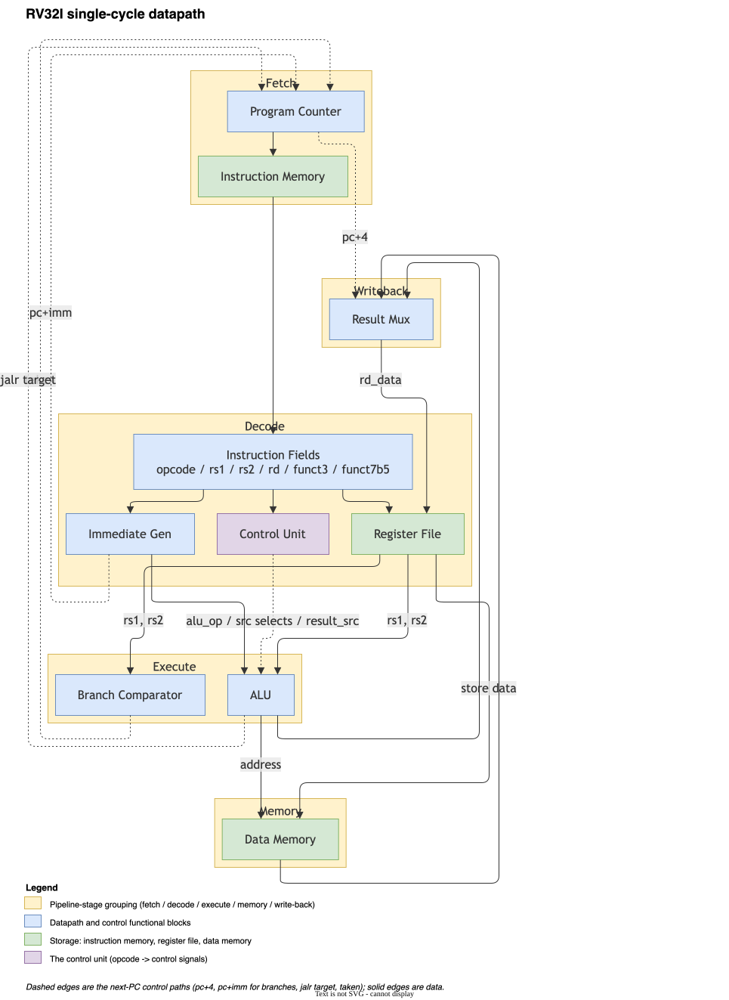
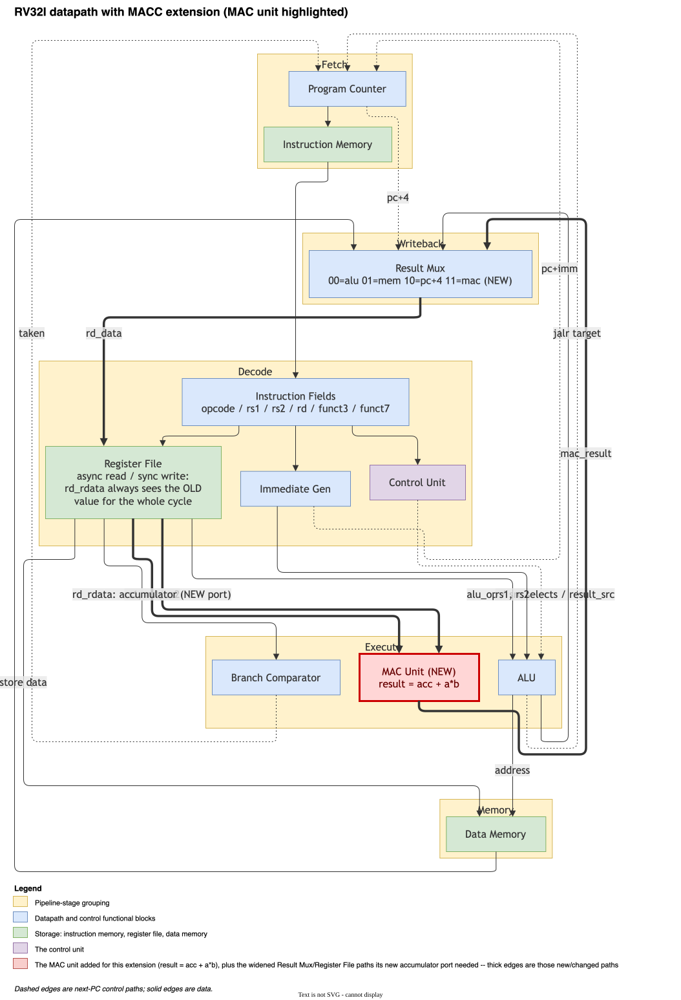
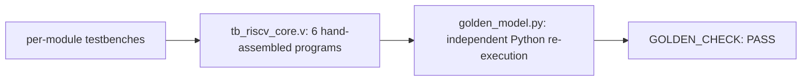

# riscv-core


A single-cycle RV32I core I wrote in Verilog to actually understand
the ISA end to end, not just read about it. Every module has its own
testbench, and the whole thing runs six hand-assembled programs to
prove the datapath is wired up correctly, not just that it compiles.

| | |
|---|---|
| Tests | 7 core checks + 4 independent golden-model cross-checks, all passing |
| ISA | RV32I (no FENCE/ECALL/CSRs) + a custom MACC multiply-accumulate extension |
| Verification | dual-layer: RTL testbench + a from-scratch Python golden model that re-derives expected values independently |

## Contents

- [The datapath](#the-datapath)
- [Modules](#modules)
- [MACC](#macc)
- [What's implemented](#whats-implemented)
- [How I'm checking it's actually correct](#how-im-checking-its-actually-correct)
- [Layout](#layout)
- [Building it](#building-it)
- [License](#license)

```
$ cd sim && make sim
...
PASS [arithmetic_mem0] = 35
PASS [sum_loop_mem4] = 55
PASS [loadstore_pass_flag] = 1
PASS [macc_single_mem0] = 142
PASS [macc_single_aliasing_mem4] = 9
PASS [macc_dot_product_mem0] = 300
PASS [macc_overflow_mem0] = 1
RISCV_CORE TB: PASS (7 checks)
GOLDEN [macc_single_mem0] = 142 (matches sim)
GOLDEN [macc_single_aliasing_mem4] = 9 (matches sim)
GOLDEN [macc_dot_product_mem0] = 300 (matches sim)
GOLDEN [macc_overflow_mem0] = 1 (matches sim)
GOLDEN_CHECK: PASS (4 checks)
```

## The datapath

I went with a single-cycle datapath instead of a pipeline on purpose. A
5-stage pipeline is the more "impressive" thing to build, but it also
means hazard detection, forwarding, branch misprediction handling — a
lot of surface area where subtle bugs hide, and a lot of that
complexity has nothing to do with actually understanding the ISA.
Single-cycle gets every instruction fetched, decoded, executed,
memory-accessed and written back in one clock edge, which makes the
whole thing easy to reason about and, more importantly, easy to
verify against hand-written test programs. Pipelining it is a natural
next step if I come back to this.



## Modules

| Module | What it does |
|---|---|
| `program_counter.v` | Holds PC, updates from `pc_next` every cycle |
| `instr_mem.v` | Word-addressed ROM, loaded via `$readmemh` |
| `imm_gen.v` | Sign-extends I/S/B/U/J-type immediates depending on opcode |
| `control_unit.v` | Turns opcode/funct3/funct7[5] into every control signal in the datapath, including the ALU op |
| `regfile.v` | 32x32-bit registers, x0 hardwired to zero, async read / sync write |
| `alu.v` | ADD/SUB/SLL/SLT/SLTU/XOR/SRL/SRA/OR/AND |
| `data_mem.v` | Byte-addressable, handles sized/signed loads and stores |
| `mac_unit.v` | Combinational: `acc + (a * b)`, used by MACC |
| `riscv_core.v` | Wires all of the above together, plus the muxes and the branch comparator |

<details>
<summary>A couple of decisions worth explaining</summary>

**The branch comparator doesn't touch the ALU.** My first instinct was
to do what a lot of textbooks do — reuse the ALU's SUB output and a
zero flag for BEQ/BNE, and reuse SLT for BLT/BGE. It works, but it
means the ALU is busy doing the branch comparison in the same cycle it
also needs to be free for JALR's target address calc. Splitting branch
resolution into its own small combinational block off `rs1_data`/
`rs2_data` sidesteps that entirely and was also just easier to get
right in isolation — `tb_riscv_core.v` doesn't even exercise the ALU
for branches, only the comparator logic does.

**ALU source A is a 3-way mux (rs1 / pc / zero), not 2-way.** This is
what lets LUI and AUIPC reuse the ALU's adder instead of needing their
own hardware: AUIPC is just `pc + imm` with alu_op=ADD, LUI is `0 +
imm`. Small thing, but it means two fewer special cases in the
write-back path.

**funct7[5] is a trap for ADDI.** This one actually bit me during
testing. For R-type instructions, bit 30 of the instruction genuinely
is `funct7[5]` and distinguishes ADD from SUB. But for `OP_IMM`
instructions with funct3=000 (ADDI), those same bits are just part of
the 12-bit immediate — there's no SUBI in RV32I, so if you're not
careful your control unit will occasionally decode an ADDI as a SUB
depending on what immediate happens to be encoded. I only caught this
because I wrote a testbench check specifically for it
(`ADDI_ignores_funct7b5` in `tb_control_unit.v`) after reading the
spec closely enough to realize the aliasing was possible — it wasn't
something I hit by accident in simulation, and it's exactly the kind
of thing that's easy to get wrong quietly.

</details>

## MACC

A custom multiply-accumulate instruction on top of RV32I: `MACC rd,
rs1, rs2` computes `rd = rd + (rs1 * rs2)` in one cycle. It exists
because dot-product-style workloads (the core of most ML inference
math) are otherwise a MUL + ADD pair per element, doubling both
instruction count and register-file traffic. It's not part of RV32I —
it's encoded in the custom-0 opcode space RISC-V reserves for exactly
this kind of extension.

### Encoding

R-type field layout:

| Field | Bits | Value |
|---|---|---|
| funct7 | [31:25] | 0000001 |
| rs2 | [24:20] | source register 2 |
| rs1 | [19:15] | source register 1 |
| funct3 | [14:12] | 000 |
| rd | [11:7] | destination / accumulator |
| opcode | [6:0] | 0001011 (custom-0) |

funct7=0000001 is documented but not checked by the decoder — see
"funct7 isn't gated" below.

### Datapath



`rd` is both a source (the accumulator) and the destination, which the
existing two register-file read ports (`rs1_data`, `rs2_data`) can't
cover — reading three different registers for one instruction needs a
third read port. `regfile.v` now exposes `rd_rdata`: a combinational
read at `rd_addr`, the same address the write port already uses.
Because that read is combinational and the write is a clocked
nonblocking assignment, `rd_rdata` reflects the OLD value for the
entire cycle no matter what MACC is about to write — the new value
isn't visible until the next posedge. No extra sequencing logic is
needed; this is just how the register file already worked for every
other instruction, MACC just needed a third port to see it.
`tb_regfile.v` has a check for this exact property
(`rd_rdata_sees_old_value_mid_write`).

`mac_unit.v` is a small combinational module alongside the ALU:
`result = acc + (a * b)`, fed by `rd_rdata`/`rs1_data`/`rs2_data`
directly, not through the ALU's source muxes. It always computes,
same as the branch comparator — `result_src` (using its previously
unused `11` encoding) just decides whether anyone uses the output
this cycle.

### Overflow

32-bit wraparound, silent — no trap, no saturation, same behavior as
the ALU's ADD everywhere else in this core. The low 32 bits of a
32x32 product are bit-identical whether the operands are read as
signed or unsigned, so no separate signed multiply path is needed;
`tb_mac_unit.v` checks this directly (`-1 * -1 = 1`, `-1 * 5 =
0xFFFFFFFB`, both correct with no `$signed()` cast anywhere in
`mac_unit.v`).

### funct7 isn't gated

The decoder checks `opcode` and `funct3` for MACC, not `funct7`. This
core doesn't trap on any malformed instruction anywhere — an
unrecognized opcode is a silent no-op, not an illegal-instruction
exception — so checking `funct7` strictly for just this one
instruction, while every other invalid encoding in the core falls
through silently, would be inconsistent with the rest of the design.
`tb_control_unit.v`'s `MACC_funct7_not_gated` check confirms this is
deliberate, not an oversight.

<details>
<summary>A bug the golden model caught (not in the RTL)</summary>

Building `tb/golden_model.py` (see "How I'm checking it's actually
correct" below) surfaced a real bug — not in the RTL, in
`tb/programs/asm_to_hex.py`. The `halt` pseudo-op expands to `jal x0,
0`, meant as an infinite self-loop. But the assembler's jal/branch
encoding treated a bare numeric target as an *absolute* address (`off
= target - addr`), not a relative offset, so `halt` was actually
encoding a jump back to address 0 — restart the program, not
self-loop. It "worked" for every existing test program purely by
luck: restarting a deterministic program from the top recomputes the
same values, and 300 cycles was always enough for at least one full
pass before the check fires. The golden model correctly expects a
true self-loop (relative offset 0) and never saw one, which is what
surfaced this. Fixed by treating a bare numeric jal/branch target as
the relative offset directly — which also makes `halt`'s own
"infinite self-loop" comment actually true. See
`tb/programs/asm_to_hex.py` for the fix.

</details>

## What's implemented

R-type: ADD, SUB, SLL, SLT, SLTU, XOR, SRL, SRA, OR, AND
I-type: ADDI, SLTI, SLTIU, XORI, ORI, ANDI, SLLI, SRLI, SRAI, JALR
Loads/stores: LB, LH, LW, LBU, LHU, SB, SH, SW
Branches: BEQ, BNE, BLT, BGE, BLTU, BGEU
Jumps: JAL, JALR
Upper immediate: LUI, AUIPC
Custom: MACC (see above)

Not implemented: FENCE, ECALL/EBREAK, CSRs — no exceptions or
interrupts. Wasn't trying to run an OS on this, just wanted a correct
integer core.

## How I'm checking it's actually correct



Every module gets its own self-checking testbench under `tb/` before
it goes anywhere near the top-level core — I'd rather chase a bug in
a 30-line ALU than in the full datapath. Then `tb_riscv_core.v` runs
six hand-assembled programs (general ALU ops, a branch-driven loop,
load/store round trips with sign/zero extension, and three MACC
programs — a single MACC plus a register-aliasing case, a 4-element
dot product, and 32-bit wraparound) through the whole thing and checks
the results land in the right memory addresses.

For MACC specifically, `tb/check_against_golden.py` adds a second,
independent verification layer: `tb/golden_model.py` decodes and
executes the same raw instruction words the Verilog core runs and
re-derives the expected values from scratch, rather than trusting the
hardcoded constants in `tb_riscv_core.v` alone — a mistake in my
arithmetic would otherwise show up as a "passing" test checking the
wrong number. `sim/Makefile`'s `make sim` runs the entire stack,
golden check included (output at the top of this README).

## Layout

```
rtl/    synthesizable Verilog sources
tb/     testbenches + hand-assembled test programs
sim/    Makefile for Icarus Verilog
docs/   datapath diagrams
```

## Building it

Needs [Icarus Verilog](http://iverilog.icarus.com/).

```
cd sim
make sim     # assembles the test programs, runs every unit test, the full core,
             # then cross-checks the MACC results against tb/golden_model.py
make wave    # pops the last VCD open in gtkwave
```

`make sim`'s last step (`make golden`) runs `tb/check_against_golden.py`
on its own: an independent Python model decodes and executes the same
instruction words the Verilog core does, and the script diffs its
results against what the simulation actually printed. It's how the
`halt`-pseudo-op bug above got caught.

Individual modules have their own testbench too, if you just want to
poke at one:

```
iverilog -o /tmp/tb_alu.vvp rtl/alu.v tb/tb_alu.v && vvp /tmp/tb_alu.vvp
```

## License

MIT — see [LICENSE](LICENSE).
