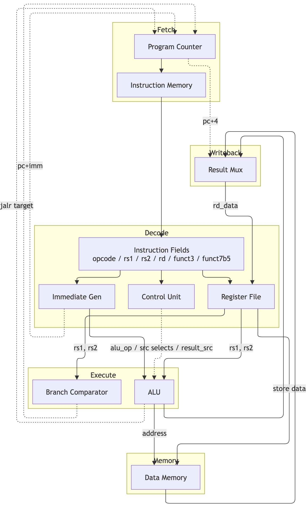

# Architecture

I went with a single-cycle datapath instead of a pipeline on purpose. A
5-stage pipeline is the more "impressive" thing to build, but it also
means hazard detection, forwarding, branch misprediction handling — a
lot of surface area where subtle bugs hide, and a lot of that
complexity has nothing to do with actually understanding the ISA.
Single-cycle gets every instruction fetched, decoded, executed,
memory-accessed and written back in one clock edge, which makes the
whole thing easy to reason about and, more importantly, easy to
verify against hand-written test programs. Pipelining it is a natural
next step if I come back to this.

## The datapath

(source: [`diagrams/datapath.drawio`](diagrams/datapath.drawio), open
it in [diagrams.net](https://app.diagrams.net) if you want to poke at
it)

## Modules

| Module | What it does |
|---|---|
| `program_counter.v` | Holds PC, updates from `pc_next` every cycle |
| `instr_mem.v` | Word-addressed ROM, loaded via `$readmemh` |
| `imm_gen.v` | Sign-extends I/S/B/U/J-type immediates depending on opcode |
| `control_unit.v` | Turns opcode/funct3/funct7[5] into every control signal in the datapath, including the ALU op |
| `regfile.v` | 32x32-bit registers, x0 hardwired to zero, async read / sync write |
| `alu.v` | ADD/SUB/SLL/SLT/SLTU/XOR/SRL/SRA/OR/AND |
| `data_mem.v` | Byte-addressable, handles sized/signed loads and stores |
| `riscv_core.v` | Wires all of the above together, plus the muxes and the branch comparator |

## A couple of decisions worth explaining

**The branch comparator doesn't touch the ALU.** My first instinct was
to do what a lot of textbooks do — reuse the ALU's SUB output and a
zero flag for BEQ/BNE, and reuse SLT for BLT/BGE. It works, but it
means the ALU is busy doing the branch comparison in the same cycle it
also needs to be free for JALR's target address calc. Splitting branch
resolution into its own small combinational block off `rs1_data`/
`rs2_data` sidesteps that entirely and was also just easier to get
right in isolation — `tb_riscv_core.v` doesn't even exercise the ALU
for branches, only the comparator logic does.

**ALU source A is a 3-way mux (rs1 / pc / zero), not 2-way.** This is
what lets LUI and AUIPC reuse the ALU's adder instead of needing their
own hardware: AUIPC is just `pc + imm` with alu_op=ADD, LUI is `0 +
imm`. Small thing, but it means two fewer special cases in the
write-back path.

**funct7[5] is a trap for ADDI.** This one actually bit me during
testing. For R-type instructions, bit 30 of the instruction genuinely
is `funct7[5]` and distinguishes ADD from SUB. But for `OP_IMM`
instructions with funct3=000 (ADDI), those same bits are just part of
the 12-bit immediate — there's no SUBI in RV32I, so if you're not
careful your control unit will occasionally decode an ADDI as a SUB
depending on what immediate happens to be encoded. I only caught this
because I wrote a testbench check specifically for it
(`ADDI_ignores_funct7b5` in `tb_control_unit.v`) after reading the
spec closely enough to realize the aliasing was possible — it wasn't
something I hit by accident in simulation, and it's exactly the kind
of thing that's easy to get wrong quietly.

## What's implemented

R-type: ADD, SUB, SLL, SLT, SLTU, XOR, SRL, SRA, OR, AND
I-type: ADDI, SLTI, SLTIU, XORI, ORI, ANDI, SLLI, SRLI, SRAI, JALR
Loads/stores: LB, LH, LW, LBU, LHU, SB, SH, SW
Branches: BEQ, BNE, BLT, BGE, BLTU, BGEU
Jumps: JAL, JALR
Upper immediate: LUI, AUIPC

Not implemented: FENCE, ECALL/EBREAK, CSRs — no exceptions or
interrupts. Wasn't trying to run an OS on this, just wanted a correct
integer core.

## How I'm checking it's actually correct

Every module gets its own self-checking testbench under `tb/` before
it goes anywhere near the top-level core — I'd rather chase a bug in
a 30-line ALU than in the full datapath. Then `tb_riscv_core.v` runs
three hand-assembled programs (general ALU ops, a branch-driven loop,
and load/store round trips with sign/zero extension) through the
whole thing and checks the results land in the right memory
addresses. `sim/Makefile`'s `make sim` runs the entire stack.
